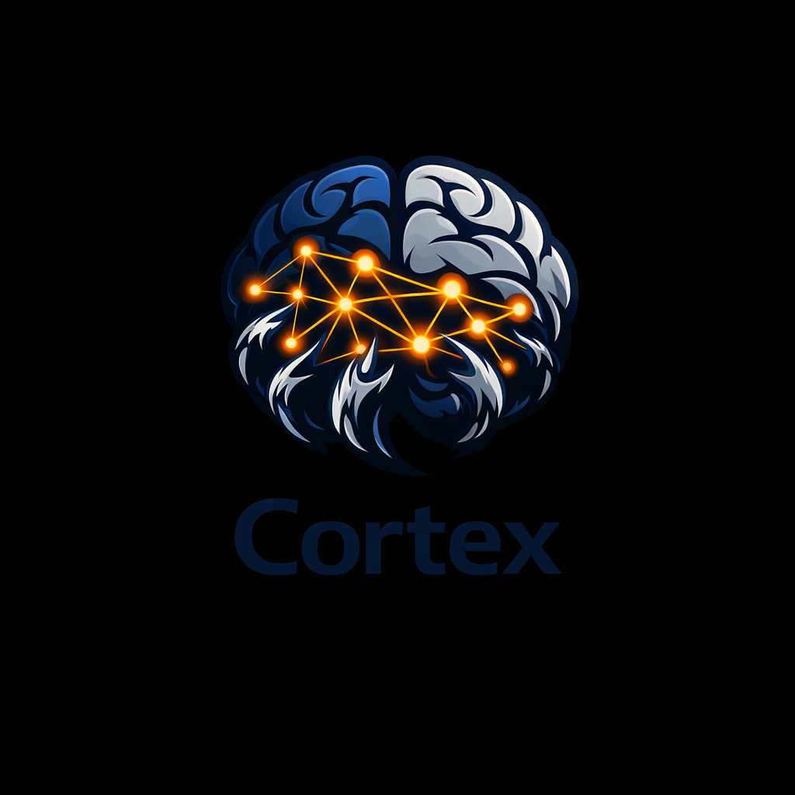

<div align="center">



# Cortex – Lokales Gedächtnis für OpenClaw

Cortex ist ein **leichtgewichtiges Go-Backend** mit SQLite-Datenbank, das als persistentes „Gehirn" für OpenClaw-Agenten dient. Es speichert Erinnerungen (Memories), Entities mit Fakten sowie Relationen zwischen Entities und bietet vollständige **Neutron-kompatible API** ohne Cloud-Abhängigkeit.

> **🎯 Hauptvorteile:** Lokal, kostenlos, kein API-Key erforderlich, vollständig Neutron-kompatibel

</div>

## ✨ Features

### Kern-Features
- ✅ **Persistente Speicherung**: Erinnerungen, Fakten und Relationen in SQLite
- ✅ **Semantische Suche**: Vektor-basierte Suche mit lokalen Embeddings
- ✅ **Lokaler Embedding-Service**: Vollständig offline, keine externen APIs
- ✅ **Neutron-kompatibel**: Gleiche API-Formate wie Vanar Neutron
- ✅ **Multi-Tenant-Support**: Isolation durch `appId` + `externalUserId`

### OpenClaw-Integration
- ✅ **Auto-Recall/Capture Hooks**: Automatisches Abrufen und Speichern von Memories
- ✅ **Skill-Integration**: Ready-to-use OpenClaw Skill mit `hooks.sh`
- ✅ **TypeScript SDK**: Vollständiges SDK für einfache Integration

### Erweiterte Features
- ✅ **Bundles**: Organisation von Memories in logische Gruppen
- ✅ **Entities & Relations**: Knowledge Graph Funktionalität
- ✅ **Webhooks**: Event-Benachrichtigungen für Memory-Änderungen
- ✅ **Analytics**: Dashboard-Daten über API
- ✅ **Export/Import**: Daten-Migration unterstützt
- ✅ **Backup/Restore**: Datenbank-Backup verfügbar
- ✅ **Rate Limiting**: Token-Bucket-Algorithmus für API-Schutz

### Technische Features
- ✅ **Leichtgewichtig**: Pure-Go (kein cgo), minimale Dependencies
- ✅ **Embedding-Support**: Optional GTE-Small via `github.com/rcarmo/gte-go` oder Hash-basiert (Standard)
- ✅ **REST-API**: Einfache HTTP-Endpunkte für alle Operationen
- ✅ **CLI-Tool**: Vollständiges CLI (`cortex-cli`) ohne jq/curl-Abhängigkeit
- ✅ **Docker Support**: Containerisierung für einfaches Deployment
- ✅ **systemd Integration**: Makefile-Targets für Service-Management

## 🚀 Quick Start

### 1. Installation

```bash
# Repository klonen
git clone https://github.com/jarvis587cb/cortex.git
cd cortex

# Binaries bauen
make build

# Server starten
make run
```

### 2. Health-Check

```bash
# Mit CLI
./cortex-cli health

# Mit curl
curl http://localhost:9123/health
```

### 3. Erste Schritte

```bash
# Memory speichern
./cortex-cli store "Der Nutzer mag Kaffee mit Hafermilch"

# Memory suchen
./cortex-cli query "Kaffee" 10

# Statistiken
./cortex-cli stats
```

## 📦 Installation & Setup

### Voraussetzungen

- **Go 1.23+** für Build und Entwicklung
- **Bash** für Scripts (optional)
- **SQLite** (wird automatisch von Go-Binary verwendet)

### Dependencies

Cortex verwendet folgende Haupt-Dependencies:

- **`github.com/glebarez/sqlite`** – Pure-Go SQLite-Implementierung (kein cgo)
- **`gorm.io/gorm`** – ORM für Datenbank-Operationen
- **`github.com/rcarmo/gte-go`** – Go-Binding für GTE-Small Embedding-Modell (optional)

**Hinweis zu `github.com/rcarmo/gte-go`:**
- Diese Dependency wird nur verwendet, wenn `CORTEX_EMBEDDING_MODEL_PATH` gesetzt ist
- Ohne diese Konfiguration verwendet Cortex den Hash-basierten Embedding-Service (keine externe Dependency)
- Die Bibliothek ermöglicht die Verwendung des GTE-Small Modells für hochwertige semantische Embeddings
- Siehe [Embeddings & Semantische Suche](#-semantische-suche--embeddings) für Details zur Konfiguration

### Build

```bash
# Beide Binaries bauen (cortex-server, cortex-cli)
make build

# Nur Server
go build -o cortex-server ./cmd/cortex-server

# Nur CLI
go build -o cortex-cli ./cmd/cortex-cli
```

### Server starten

**Option 1: Direkt (Entwicklung)**
```bash
make run
# oder
go run ./cmd/cortex-server
```

**Option 2: Als systemd Service (Produktion)**
```bash
# Service installieren und aktivieren
make service-install
make service-enable
make service-start

# Status prüfen
make service-status

# Logs anzeigen
make service-logs
```

**Option 3: Docker**
```bash
docker-compose up -d
```

### Konfiguration

Die Datei `.env` wird nicht ins Repository committed. Für lokale Anpassungen:

```bash
cp .env.example .env
# .env bearbeiten
```

**Umgebungsvariablen:**

| Variable | Beschreibung | Standard |
|----------|--------------|----------|
| `CORTEX_DB_PATH` | Pfad zur SQLite-Datei | `~/.openclaw/cortex.db` |
| `CORTEX_PORT` | Server-Port | `9123` |
| `CORTEX_LOG_LEVEL` | Log-Level (debug/info/warn/error) | `info` |
| `CORTEX_RATE_LIMIT` | Rate Limit (Requests/Zeitfenster) | `100` |
| `CORTEX_RATE_LIMIT_WINDOW` | Rate Limit Zeitfenster | `1m` |
| `CORTEX_API_KEY` | Optional: API-Key für Auth | - |
| `CORTEX_EMBEDDING_MODEL_PATH` | Pfad zur GTE-Small .gtemodel Datei | - (Hash-Service) |

> **Hinweis:** Lokale Installation benötigt **keinen API-Key**. API-Key ist nur für Produktion/Multi-User-Setups.

## 🎮 CLI-Tool (`cortex-cli`)

Das CLI-Tool bietet alle Funktionen ohne externe Abhängigkeiten:

### Memories

```bash
# Memory speichern
./cortex-cli store "Text" '[{"type":"fact"}]'

# Memory mit Metadata-Typen speichern
./cortex-cli store "Carsten bevorzugt dunkles Theme" '{"typ":"persönlich","kategorie":"präferenz"}'
./cortex-cli store "Gateway restart um 14:30" '{"typ":"system","kategorie":"gateway"}'
./cortex-cli store "docker-compose up -d" '{"typ":"bash","kategorie":"docker"}'

# Semantische Suche
./cortex-cli query "Suchbegriff" 10 0.5

# Semantische Suche mit Metadata-Filter
./cortex-cli query "Theme" 10 0.5 '{"typ":"persönlich"}'
./cortex-cli query "Gateway" 10 0.5 '{"typ":"system"}'

# Mit seedIDs und metadataFilter
./cortex-cli query "Theme" 10 0.5 "1,2,3" '{"typ":"persönlich"}'

# Memory löschen
./cortex-cli delete <id>

# Statistiken
./cortex-cli stats
```

**Metadata-Typen:**
- `persönlich`: Präferenzen, persönliche Informationen
- `system`: Gateway-Checks, Cron-Logs, System-Events
- `bash`: Wichtige Commands aus Bash-History
- `decision`: Wichtige Entscheidungen

### Entities (Key-Value Fakten)

```bash
# Fact hinzufügen
./cortex-cli entity-add carsten lieblingsfarbe blau

# Entity abrufen
./cortex-cli entity-get carsten
```

### Relations (Knowledge Graph)

```bash
# Relation anlegen
./cortex-cli relation-add carsten typescript programmiert

# Relations abrufen
./cortex-cli relation-get carsten
```

### Agent Contexts

```bash
# Context erstellen
./cortex-cli context-create "agent" episodic '{}'

# Contexts auflisten
./cortex-cli context-list "agent"

# Context abrufen
./cortex-cli context-get <id>
```

### Weitere Befehle

```bash
# Embeddings nachziehen
./cortex-cli generate-embeddings 100

# Performance-Benchmark
./cortex-cli benchmark 50

# API-Key verwalten
./cortex-cli api-key create
./cortex-cli api-key show
./cortex-cli api-key delete

# Hilfe
./cortex-cli help
```

**Umgebungsvariablen für CLI:**
- `CORTEX_API_URL` – API Base URL (Standard: `http://localhost:9123`)
- `CORTEX_APP_ID` – App-ID für Multi-Tenant (Standard: `openclaw`)
- `CORTEX_USER_ID` – User-ID für Multi-Tenant (Standard: `default`)

## Dashboard

Der cortex-server liefert ein eingebettetes **React-Dashboard** unter `/dashboard/`.

- **Produktion:** Nach `make build-dashboard` und `make build` enthält das Binary die SPA. Aufruf: `http://localhost:9123/dashboard/`
- **Dev mit HMR:** `make dev` startet Vite und den Server; Anfragen unter `/dashboard/` werden an den Vite-Dev-Server (Port 5173) weitergeleitet. Optional: `CORTEX_CORS_ORIGIN=http://localhost:5173` setzen, wenn das Dashboard von anderem Port auf die API zugreift.

**Makefile:**
- `make build-dashboard` – baut das Dashboard nach `internal/dashboard/dist` (für Embed)
- `make build` – baut die Go-Binaries (nutzt bereits gebautes Dashboard, falls vorhanden)
- `make dev` – startet Vite und Server mit `CORTEX_ENV=dev` (Proxy auf Vite für HMR)

**Seiten:** Übersicht (Stats/Analytics), Memories (Liste/Löschen), Entities, Relations, Einstellungen (Tenant, API-Key).

## 🔗 OpenClaw-Integration

### Skill-Installation

Cortex bietet ein OpenClaw-Skill mit Auto-Recall/Capture Hooks:

```bash
# Skill ist bereits im Repository enthalten
# Pfad: skills/cortex/

# Hooks testen
./skills/cortex/test-hooks.sh
```

### Hooks-Konfiguration

Die Hooks werden automatisch von OpenClaw aufgerufen. Konfiguration via `.env`:

```bash
# Hooks aktivieren/deaktivieren
CORTEX_AUTO_RECALL=true      # Default: true
CORTEX_AUTO_CAPTURE=true     # Default: true

# API-Konfiguration
CORTEX_API_URL=http://localhost:9123
CORTEX_APP_ID=openclaw
CORTEX_USER_ID=default

# Recall-Parameter
CORTEX_RECALL_LIMIT=5        # Max Ergebnisse
CORTEX_RECALL_THRESHOLD=0.5  # Ähnlichkeitsschwelle
```

### Hook-Verwendung

**Recall-Hook (vor AI-Interaktion):**
```bash
echo '{"message": "user question"}' | ./skills/cortex/hooks.sh recall
```

**Capture-Hook (nach Konversation):**
```bash
cat <<EOF | ./skills/cortex/hooks.sh capture
{
  "content": "User: Hello\nAI: Hi there!",
  "appId": "openclaw",
  "userId": "user123"
}
EOF
```

Siehe [skills/cortex/SKILL.md](skills/cortex/SKILL.md) für vollständige Hook-Dokumentation.

## 🛠️ Makefile-Targets

Das Makefile bietet bequeme Befehle für Entwicklung und Deployment:

### Build & Run

```bash
make build          # Baut beide Binaries
make run            # Startet den Server
make test           # Führt alle Tests aus
make clean          # Entfernt Build-Artefakte
make install        # Installiert Binaries nach /usr/local/bin
```

### Service-Management (systemd)

```bash
make service-install    # Installiert systemd Service
make service-enable     # Aktiviert Service beim Login
make service-start      # Startet Service
make service-stop       # Stoppt Service
make service-restart    # Startet Service neu
make service-status     # Zeigt Status
make service-logs       # Zeigt Logs (follow mode)
make service-disable    # Deaktiviert Service
```

### Utilities

```bash
make kill            # Beendet Prozess auf Cortex-Port
make help            # Zeigt alle verfügbaren Targets
```

## 📡 API-Endpunkte

### Neutron-kompatible Seeds-API

Vollständig kompatibel mit Neutron Memory API:

#### `POST /seeds` – Memory speichern

```bash
curl -X POST http://localhost:9123/seeds \
  -H "Content-Type: application/json" \
  -d '{
    "appId": "openclaw",
    "externalUserId": "user1",
    "content": "Der Nutzer mag Kaffee mit Hafermilch",
    "metadata": {"tags": ["preferences", "coffee"]}
  }'
```

#### `POST /seeds/query` – Semantische Suche

```bash
curl -X POST http://localhost:9123/seeds/query \
  -H "Content-Type: application/json" \
  -d '{
    "appId": "openclaw",
    "externalUserId": "user1",
    "query": "Kaffee-Präferenzen",
    "limit": 5,
    "threshold": 0.5
  }'
```

#### `DELETE /seeds/:id` – Memory löschen

```bash
curl -X DELETE "http://localhost:9123/seeds/1?appId=openclaw&externalUserId=user1"
```

#### `POST /seeds/generate-embeddings` – Embeddings generieren

```bash
curl -X POST "http://localhost:9123/seeds/generate-embeddings?batchSize=10"
```

### Agent Contexts API

#### `POST /agent-contexts` – Context erstellen

```bash
curl -X POST http://localhost:9123/agent-contexts \
  -H "Content-Type: application/json" \
  -d '{
    "appId": "openclaw",
    "externalUserId": "user1",
    "agentId": "my-agent",
    "memoryType": "episodic",
    "payload": {"key": "value"}
  }'
```

#### `GET /agent-contexts` – Contexts auflisten

```bash
curl "http://localhost:9123/agent-contexts?appId=openclaw&externalUserId=user1&agentId=my-agent"
```

#### `GET /agent-contexts/:id` – Context abrufen

`appId` und `externalUserId` (Query) sind erforderlich (Tenant-Isolation).

```bash
curl "http://localhost:9123/agent-contexts/1?appId=openclaw&externalUserId=user1"
```

### Cortex-API (Erweitert)

#### Entities & Relations

```bash
# Entity-Fact setzen
curl -X POST "http://localhost:9123/entities?entity=user:jarvis" \
  -H "Content-Type: application/json" \
  -d '{"key": "favorite_coffee", "value": "Latte mit Hafermilch"}'

# Entity abrufen
curl "http://localhost:9123/entities?name=user:jarvis"

# Relation hinzufügen
curl -X POST http://localhost:9123/relations \
  -H "Content-Type: application/json" \
  -d '{"from": "user:jarvis", "to": "user:alice", "type": "friend"}'

# Relations abrufen
curl "http://localhost:9123/relations?entity=user:jarvis"
```

#### Bundles

```bash
# Bundle erstellen
curl -X POST "http://localhost:9123/bundles?appId=myapp&externalUserId=user123" \
  -H "Content-Type: application/json" \
  -d '{"name": "Coffee Preferences"}'

# Bundles auflisten
curl "http://localhost:9123/bundles?appId=myapp&externalUserId=user123"
```

#### Statistiken & Health

```bash
# Health-Check
curl http://localhost:9123/health

# Statistiken
curl http://localhost:9123/stats
```

Vollständige API-Dokumentation: Siehe [docs/API.md](docs/API.md)

## 🔍 Semantische Suche & Embeddings

Cortex unterstützt semantische Suche mit **vollständig lokalen Embeddings**:

### Embedding-Optionen

Cortex bietet zwei Embedding-Methoden:

#### 1. **GTE-Small Modell** (Empfohlen für beste Qualität)

- ✅ **384-dimensionale Embeddings** – GTE-Small Modell (Alibaba DAMO Academy)
- ✅ **Hochwertige Semantik** – State-of-the-art Text-Embeddings
- ✅ **Vollständig lokal** – Keine externe API nötig
- ✅ **Keine API-Keys** – Funktioniert komplett offline
- ⚠️ **Modell-Download erforderlich** – ~70MB Modell-Datei
- ✅ **Pure Go** – Verwendet `github.com/rcarmo/gte-go` für Go-Bindings

**Technische Details:**
- Verwendet die Go-Bibliothek [`github.com/rcarmo/gte-go`](https://github.com/rcarmo/gte-go) für GTE-Small Modell-Unterstützung
- Die Bibliothek wird automatisch via `go mod` installiert, wenn das Modell verwendet wird
- Das Modell wird als `.gtemodel` Datei geladen (nicht zur Compile-Zeit eingebettet)

**Setup:**

```bash
# 1. Modell herunterladen und konvertieren
./scripts/download-gte-model.sh

# 2. In .env aktivieren
echo "CORTEX_EMBEDDING_MODEL_PATH=~/.openclaw/gte-small.gtemodel" >> .env

# 3. Server neu starten
make service-restart
```

#### 2. **Hash-basierter Service** (Standard, kein Download)

- ✅ **384-dimensionale Embeddings** – Lokale Hash-basierte Generierung
- ✅ **Sofort einsatzbereit** – Kein Download erforderlich
- ✅ **Vollständig offline** – Keine externe API nötig
- ✅ **Keine API-Keys** – Funktioniert ohne Konfiguration
- ✅ **Synonym-Erweiterung** – Begriffe wie Kaffee/Latte/Espresso werden verknüpft
- ⚠️ **Niedrigere Qualität** – Für einfache Anwendungen ausreichend

**Standard-Verhalten:** Wenn `CORTEX_EMBEDDING_MODEL_PATH` nicht gesetzt ist, wird automatisch der Hash-Service verwendet.

### Verwendung

```bash
# Memory speichern (Embedding wird automatisch generiert)
./cortex-cli store "Der Benutzer mag Kaffee und liest gerne Bücher"

# Semantische Suche
./cortex-cli query "Was mag der Benutzer trinken?" 5

# Embeddings für bestehende Memories nachziehen
./cortex-cli generate-embeddings 100
```

Die Suche verwendet **Cosine-Similarity** und gibt `similarity`-Scores (0.0-1.0) zurück.

### Vergleich

| Feature | GTE-Small | Hash-Service |
|---------|-----------|--------------|
| **Qualität** | ⭐⭐⭐⭐⭐ Hoch | ⭐⭐⭐ Mittel |
| **Performance** | ~3x langsamer | Sehr schnell |
| **Modell-Größe** | ~70MB | 0MB |
| **Setup** | Download nötig | Sofort nutzbar |
| **Pure Go** | ✅ Ja | ✅ Ja |
| **Empfohlen für** | Produktion, beste Qualität | Entwicklung, schnelle Tests |

## 📚 TypeScript SDK

Cortex bietet ein offizielles TypeScript SDK:

### Installation

```bash
cd sdk
npm install
npm run build
```

### Verwendung

```typescript
import { CortexClient } from "@cortex/memory-sdk";

const client = new CortexClient({
  baseUrl: "http://localhost:9123",
  appId: "myapp",
  externalUserId: "user123",
});

// Memory speichern
const memory = await client.storeMemory({
  appId: "myapp",
  externalUserId: "user123",
  content: "Der Benutzer mag Kaffee",
  metadata: { source: "chat" },
});

// Memory-Suche
const results = await client.queryMemory({
  appId: "myapp",
  externalUserId: "user123",
  query: "Was mag der Benutzer?",
  limit: 5,
});

// Bundle erstellen
const bundle = await client.createBundle({
  appId: "myapp",
  externalUserId: "user123",
  name: "Coffee Preferences",
});
```

Siehe [sdk/README.md](sdk/README.md) für vollständige Dokumentation.

## 🔄 Migration von Neutron

Cortex ist eine **vollständig lokale Alternative** zu Vanar Neutron. Migration ist einfach:

### Code-Änderungen

```typescript
// Vorher (Neutron)
import { NeutronClient } from '@vanar/neutron-sdk';
const client = new NeutronClient({
    apiKey: 'nk_...',
    baseUrl: 'https://api-neutron.vanarchain.com'
});

// Nachher (Cortex) – nur Base-URL ändern, kein API-Key nötig
import { CortexClient } from '@cortex/memory-sdk';
const client = new CortexClient({
    baseUrl: 'http://localhost:9123' // Lokaler Server
});

// API-Calls bleiben identisch
await client.storeMemory({...});
await client.queryMemory({...});
```

### Vorteile

- 🏠 **Lokal**: Keine Cloud-Abhängigkeit
- 💰 **Kostenlos**: Keine API-Kosten
- 🔒 **Privacy**: 100% lokale Datenhaltung
- ⚡ **Schnell**: Keine Netzwerk-Latenz

Siehe [docs/VERGLEICH_OPENCLAW_GUIDE.md](docs/VERGLEICH_OPENCLAW_GUIDE.md) für detaillierten Vergleich.

## 🏗️ Architektur

### Komponenten

1. **cortex-server** – Go-Backend mit SQLite und HTTP-API
2. **cortex-cli** – CLI-Tool für alle Operationen
3. **OpenClaw Skill** – Hooks für Auto-Recall/Capture
4. **TypeScript SDK** – Client-Library für Integration

### Code-Struktur

```
cortex/
├── cmd/
│   ├── cortex-server/    # Server-Binary
│   └── cortex-cli/        # CLI-Binary
├── internal/
│   ├── api/              # HTTP-Handler
│   ├── store/            # Datenbank-Operationen
│   ├── models/           # Datenmodelle
│   ├── embeddings/       # Embedding-Generierung
│   ├── helpers/          # Utility-Funktionen
│   └── middleware/       # HTTP-Middleware
├── skills/
│   └── cortex/           # OpenClaw Skill
│       ├── hooks.sh      # Auto-Recall/Capture Hooks
│       └── SKILL.md      # Skill-Dokumentation
├── sdk/                   # TypeScript SDK
└── docs/                  # Dokumentation
```

### Datenbank

- **SQLite** (`~/.openclaw/cortex.db`)
- **Pure-Go** (kein cgo)
- **Automatische Migrationen** via GORM

## 📖 Dokumentation

- **[skills/cortex/SKILL.md](skills/cortex/SKILL.md)** – Vollständige Skill-Dokumentation
- **[docs/VERGLEICH_OPENCLAW_GUIDE.md](docs/VERGLEICH_OPENCLAW_GUIDE.md)** – Vergleich mit OpenClaw Neutron Guide
- **[docs/CORTEX_NEUTRON_ALTERNATIVE.md](docs/CORTEX_NEUTRON_ALTERNATIVE.md)** – Feature-Vergleich mit Neutron
- **[docs/INTEGRATION_GUIDE.md](docs/INTEGRATION_GUIDE.md)** – Cross-Platform Integration Guide
- **[docs/API.md](docs/API.md)** – Vollständige API-Dokumentation
- **[docs/PERFORMANCE.md](docs/PERFORMANCE.md)** – Performance-Benchmarks

## 🧪 Entwicklung

### Tests

```bash
# Alle Tests ausführen
make test

# Mit Coverage
go test -cover ./...

# Spezifische Tests
go test -v ./internal/store/...
```

### Build

```bash
# Development
make build
make run

# Production
go build -ldflags="-s -w" -o cortex-server ./cmd/cortex-server
go build -ldflags="-s -w" -o cortex-cli ./cmd/cortex-cli
```

### Docker

```bash
# Image bauen
docker build -t cortex .

# Mit docker-compose
docker-compose up -d
```

## 🐛 Troubleshooting

### Port bereits belegt

```bash
# Prozess auf Port finden und beenden
make kill

# Oder anderen Port verwenden
CORTEX_PORT=9124 make run
```

### Datenbank-Fehler

```bash
# Datenbank-Pfad prüfen
ls -la ~/.openclaw/cortex.db

# Datenbank löschen (Vorsicht: Datenverlust!)
rm ~/.openclaw/cortex.db
```

### API nicht erreichbar

```bash
# Health-Check
./cortex-cli health

# Server-Logs prüfen
make service-logs
```

### Hooks funktionieren nicht

```bash
# Hooks testen
./skills/cortex/test-hooks.sh

# Env-Variablen prüfen
echo $CORTEX_AUTO_RECALL
echo $CORTEX_API_URL
```

## 📄 Lizenz

MIT License

## 🙏 Credits

Cortex ist eine lokale Alternative zu [Vanar Neutron](https://openclaw.vanarchain.com/guide-openclaw) und bietet vollständige Kompatibilität ohne Cloud-Abhängigkeit.
