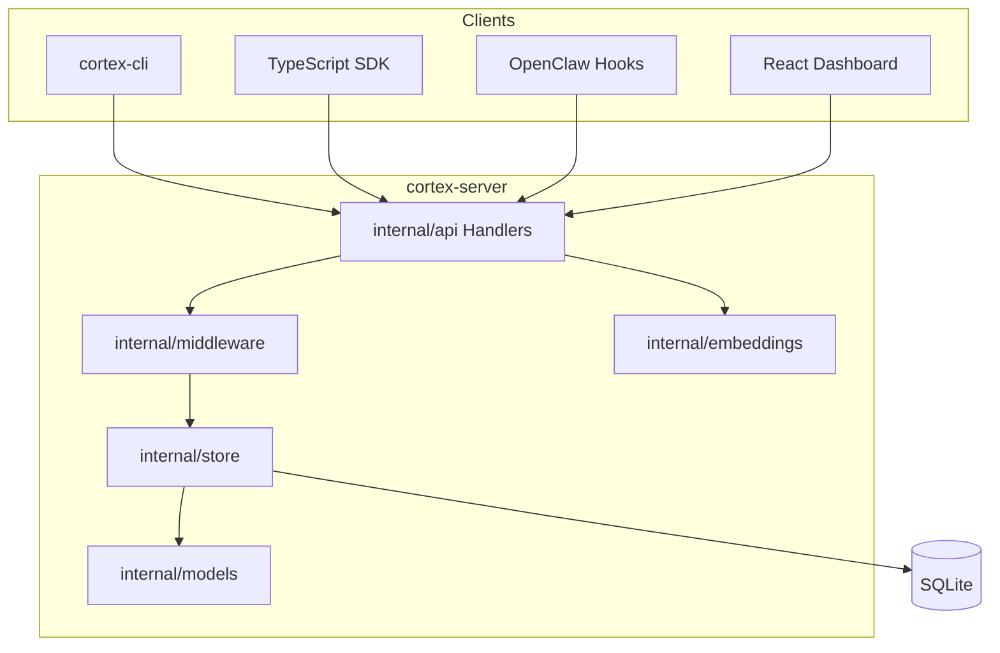

# Cortex – Projektanalyse

## 1. Zweck und Positionierung

**Cortex** ist ein leichtgewichtiges, **vollständig lokales** „Gedächtnis“ für OpenClaw-Agenten. Es bietet dieselben API-Formate wie **Vanar Neutron**, ohne Cloud oder API-Keys. Nutzung: persistente Erinnerungen (Memories), semantische Suche, Entities/Relations (Knowledge Graph), Agent Contexts, Bundles, Webhooks und optionales Rate-Limiting/API-Key-Auth.

---

## 2. Tech-Stack

| Schicht        | Technologie                                                                                                |
| -------------- | ---------------------------------------------------------------------------------------------------------- |
| **Backend**    | Go 1.23, `net/http` (kein Framework)                                                                       |
| **Datenbank**  | SQLite via [glebarez/sqlite](../internal/store/store.go) (pure Go, kein cgo), GORM                         |
| **Embeddings** | Optional [gte-go](../internal/embeddings/embeddings.go) (GTE-Small) oder Hash-basierter Service            |
| **Frontend**   | React 19, React Router 7, TypeScript, Vite 7 → Build in `internal/dashboard/dist`, vom Server ausgeliefert |
| **SDK**        | TypeScript ([sdk/](../sdk/)), Package `@cortex/memory-sdk`                                                 |
| **Deployment** | Makefile, Docker, systemd (User-Service)                                                                   |

---

## 3. Architektur (High-Level)

- **Einstiegspunkte:** [cmd/cortex-server/main.go](../cmd/cortex-server/main.go) (HTTP-Server, Port 9123), [cmd/cortex-cli/main.go](../cmd/cortex-cli/main.go) (CLI, spricht mit der API).
- **Routing:** In `main.go`: Health, Neutron-kompatible Seeds-API (`/seeds`, `/seeds/query`, `/seeds/:id`, generate-embeddings), Bundles, Entities, Relations, Agent-Contexts, Stats; optional API-Key + Rate-Limit-Middleware.
- **Daten:** [internal/models/models.go](../internal/models/models.go) definiert die Modelle; [internal/store/](../internal/store/) (store, export, analytics) kapselt alle DB-Operationen.

---

## 4. Wichtige Verzeichnisse und Dateien

| Pfad | Rolle |
| ---------------------------------------------------------- | ------------------------------------------------------------------------------------- |
| [cmd/cortex-server/](../cmd/cortex-server/) | Server-`main`: Logging, Store-Init, Router, Einbindung Dashboard |
| [cmd/cortex-cli/](../cmd/cortex-cli/) | CLI: store, query, delete, stats, entity-*, relation-*, context-*, api-key, benchmark |
| [internal/api/handlers.go](../internal/api/handlers.go) | HTTP-Handler für alle Endpunkte |
| [internal/store/](../internal/store/) | GORM/SQLite: Store, Export, Analytics (+ Tests) |
| [internal/models/models.go](../internal/models/models.go) | Datenmodelle |
| [internal/embeddings/](../internal/embeddings/) | Embedding-Erzeugung (Hash oder GTE), Vektor-Utils |
| [internal/middleware/](../internal/middleware/) | Auth, Rate-Limit (Token-Bucket) |
| [internal/dashboard/serve.go](../internal/dashboard/serve.go) | Auslieferung der eingebetteten SPA unter `/dashboard/` |
| [dashboard/](../dashboard/) | React/Vite-Quellcode (Overview, Memories, Entities, Relations, Settings) |
| [sdk/](../sdk/) | TypeScript-SDK für die Memory-API |
| [skills/cortex/](../skills/cortex/) | OpenClaw-Skill: `hooks.sh` (recall/capture), SKILL.md, systemd-Service |
| [docs/](../docs/) | API, Neutron-Vergleich, Integration, Performance, Analysen |

---

## 5. Build, Run und CI

- **Build:** `make build` → `cortex-server` + `cortex-cli`. Dashboard: `make build-dashboard` (→ `internal/dashboard/dist`), danach `make build` für Server inkl. eingebettetem Dashboard.
- **Run:** `make run` (Server), `make dev` (Vite + Server mit Proxy für HMR).
- **Deployment:** systemd (`make service-install`, `service-enable`, `service-start`) oder `docker-compose up -d`.
- **CI:** [.github/workflows/ci.yml](../.github/workflows/ci.yml) – Go 1.23, Tests mit Race + Coverage, Codecov.

---

## 6. Konfiguration (Auszug)

Über `.env` (siehe [.env.example](../.env.example)): `CORTEX_DB_PATH`, `CORTEX_PORT` (9123), `CORTEX_LOG_LEVEL`, `CORTEX_RATE_LIMIT`/`CORTEX_RATE_LIMIT_WINDOW`, optional `CORTEX_API_KEY`, optional `CORTEX_EMBEDDING_MODEL_PATH` für GTE-Small.

---

## 7. Dokumentation (Überblick)

- **Root:** [README.md](../README.md) – Quick Start, Features, Konfiguration, CLI, API, Embeddings, SDK, Skill, Makefile, Troubleshooting.
- **docs/:** [README.md](README.md) – Index; u.a. [API.md](API.md), [TEST_REPORT.md](TEST_REPORT.md), Neutron-Vergleich, [INTEGRATION_GUIDE.md](INTEGRATION_GUIDE.md), [PERFORMANCE.md](PERFORMANCE.md), [ANALYSE.md](ANALYSE.md) (diese Projektanalyse, inkl. behobene Bugs).

---

## 8. Behobene Bugs / Überprüfte Bereiche

- **Behoben:** `UnmarshalEntityData` und `UnmarshalMetadata` gaben bei JSON-`"null"` (z. B. in der DB) `nil` zurück. Aufrufer wie `HandleSetFact` führten danach `data[req.Key] = req.Value` aus und erzeugten eine **Panic**. Beide Hilfsfunktionen liefern nun in diesem Fall ein leeres `map[string]any{}`. Siehe [internal/helpers/helpers.go](../internal/helpers/helpers.go) und Tests `TestUnmarshalEntityDataNull`, `TestUnmarshalMetadataNull`.
- **Behoben:** **Path-Traversal** bei Backup/Restore: Die Query-Parameter `path` wurden ungeprüft an `BackupDatabase` bzw. `CopyFile`/`FileExists` übergeben. Es gibt nun `helpers.ValidateBackupPath`; ungültige Pfade → 400. Tests: `TestValidateBackupPath`.
- **Behoben:** **Tenant-Isolation:** `GET /agent-contexts/:id` lieferte jeden Agent-Context nur anhand der ID (ohne Tenant-Prüfung). Jetzt sind `appId` und `externalUserId` (Query) erforderlich; es wird `GetAgentContextByIDAndTenant` verwendet. `DELETE /webhooks/:id` löschte beliebige Webhooks; jetzt ist `appId` (Query) erforderlich, es wird nur das Webhook mit passendem `app_id` gelöscht (`GetWebhookByIDAndApp`).
- **Behoben:** **CLI:** `context-get <id>` sendete keine Tenant-Parameter; die API verlangt sie seit dem Tenant-Fix. Die CLI hängt nun `?appId=...&externalUserId=...` (aus client.appID/client.userID) an die Anfrage.
- **Überprüft:** Tenant-Isolation bei Delete (Seeds, Bundles) ist korrekt; ID-Parsing und Pfad-Extraktion (z. B. `/seeds/123`) mit Tests; Race-Tests (`go test -race ./...`) laufen ohne Fehler.

---

## 9. Kurzfassung

Cortex ist ein **Go-Backend** mit SQLite und GORM, **Neutron-kompatibler REST-API**, optionalen lokalen Embeddings (Hash oder GTE-Small), **React-Dashboard** (Vite), **TypeScript-SDK** und **OpenClaw-Skill** mit Recall/Capture-Hooks. Alles lokal betreibbar; Build/Start über Makefile, Docker oder systemd; ausführliche Doku im README und unter `docs/`.
